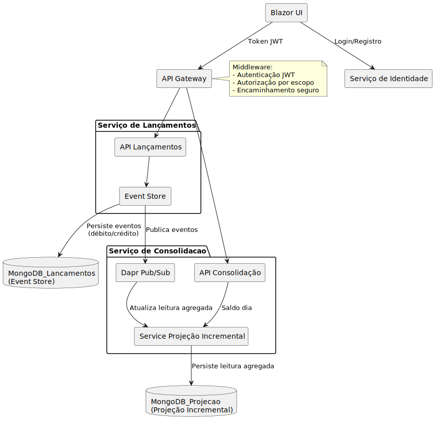

# DaprAspire - Sistema de Gerenciamento Financeiro com Arquitetura Orientada a Eventos

Este repositório contém uma aplicação financeira distribuída baseada em microserviços, utilizando o .NET Aspire com Dapr para comunicação assíncrona, projeções incrementais, autenticação via Identity Server com JWT e um front-end Blazor WebAssembly integrado via API Gateway (YARP).

---

## 🛠 Como rodar a aplicação

### Pré-requisitos

- [.NET 9 SDK](https://dotnet.microsoft.com/download)
- [Dapr CLI](https://docs.dapr.io/getting-started/install-dapr/)
- [Docker Desktop](https://www.docker.com/products/docker-desktop/) (para MongoDB)
- [Aspire Dashboard](https://learn.microsoft.com/en-us/dotnet/aspire/overview) (opcional, mas recomendado)

### Passos

1. **Clone o repositório:**

   ```bash
   git clone https://github.com/SouzaHenrique/DaprAspire.git   
   ```

2. **Instale e inicialize o Dapr:**

   ```bash
   winget install Dapr.CLI
   dapr init
   ```

3. **Configuração de Segredos Locais**

    Este projeto utiliza o mecanismo de [User Secrets](https://learn.microsoft.com/aspnet/core/security/app-secrets) do .NET para armazenar configurações sensíveis, como as chaves JWT utilizadas pelo Gateway e pelo serviço de       identidade.

    Esses dados **não são versionados no repositório** por motivos de segurança, mas os projetos já possuem os elementos `<UserSecretsId>` definidos em seus respectivos arquivos `.csproj`. Portanto, **é necessário definir os        segredos localmente** antes de rodar a aplicação.

    > ⚠️ **Importante:** Utilize exatamente os mesmos valores de `Key`, `Issuer` e `Audience` tanto no Gateway quanto no IdentityService para garantir a geração e validação correta dos tokens JWT.

    ### 💡 Como configurar os secrets

    Abra um terminal e execute os comandos abaixo:

    3.1 Segredos do Gateway (DaprAspire.Gateway)

    ```bash
    dotnet user-secrets set "Jwt:Key" "sua-chave-jwt-super-secreta" 
    dotnet user-secrets set "Jwt:Issuer" "DaprAspire.Gateway"
    dotnet user-secrets set "Jwt:Audience" "DaprAspire.FrontEnd"
    ```

    3.2 Segredos do Serviço de Identidade (DaprAspire.IdentityService.Api)
    ```bash
    dotnet user-secrets set "Jwt:Key" "sua-chave-jwt-super-secreta"
    dotnet user-secrets set "Jwt:Issuer" "DaprAspire.Gateway"
    dotnet user-secrets set "Jwt:Audience" "DaprAspire.FrontEnd"
    ```
   

4. **Execute o Aspire AppHost:**

   ```bash
   cd DaprAspire
   dotnet run --project DaprAspire.AppHost
   ```

5. **Acesse via navegador:**

   - **Front-end:** http://localhost:7016  
   - **Swagger Gateway:** http://localhost:{porta-do-gateway}/swagger  
   - **Aspire Dashboard:** http://localhost:18888

6. **Usuarios padrão para acessar o app:**
   - **usuário:** Admin | **senha:** Admin@123
   - **usuário:** User  | **senha:** User@123

---

## 🏗 Arquitetura

A arquitetura segue o estilo **microsserviços orientado a eventos**, com **Dapr Pub/Sub**, **JWT para autenticação**, **YARP como API Gateway**, **MongoDB como armazenamento principal** e **EventFlow para Event Sourcing**.



### Componentes principais:

| Componente               | Papel |
|--------------------------|-------|
| **Blazor UI**            | Interface do usuário (SPA) integrada via Gateway |
| **Gateway (YARP)**       | Roteia requisições para os microserviços e aplica autenticação/autorização |
| **Serviço de Identidade**| Autenticação JWT via ASP.NET Identity + MongoDB |
| **Serviço de Lançamentos**| Event Sourcing com comandos de crédito/débito |
| **Serviço de Consolidação** | Projeção incremental baseada em eventos via Dapr Pub/Sub |
| **MongoDB**              | Armazenamento dos eventos e projeções |

### Tecnologias

- **ASP.NET Core**
- **Blazor WebAssembly**
- **MudBlazor** (UI)
- **MongoDB**
- **Dapr** (Sidecar, Pub/Sub, State Store)
- **YARP** (API Gateway com suporte a Swagger)
- **Serilog** (Log estruturado)
- **EventFlow** (Event Sourcing/CQRS)
- **JWT** (Token de autenticação)
- **Aspire Dashboard** (Observabilidade e orquestração)

---

## ⚙️ Funcionamento

### Autenticação

- Login via `/identity/api/Account/login` pelo gateway.
- Retorno de **JWT** para requisições autenticadas subsequentes.
- O gateway valida e aplica escopo baseado na role (`admin`, `user`).

### Lançamentos

- Criação de um lançamento gera um **evento** persistido em MongoDB.
- Evento é publicado via **Dapr Pub/Sub** para consolidação.

### Consolidação

- Projeção **incremental** baseada nos eventos recebidos.
- Persistência em MongoDB e consulta via `/consolidation/projections/daily/{ledgerId}`.

### Frontend

- Tela de login (Blazor)
- Listagem de Ledgers com ações:
  - Criar Ledger
  - Adicionar Crédito/Débito
  - Consultar Saldo Diário

### Observabilidade

- **Serilog** para logs estruturados.
- **Aspire Dashboard** para status e tracing.

---

## 🔐 Segurança

- **JWT** para autenticação
- **Rate Limiting** via middleware no gateway
- **Global Error Handling** em todos os serviços
- Suporte a Swagger com token JWT

## 📦 Padrões

- Clean Architecture + DDD + CQRS + Event Sourcing + PubSub
- Separação por camadas: `Domain`, `Application`, `Infrastructure`, `Api`

---

## 📌 Futuras melhorias

- ✅ **Implementar Snapshot Engine** para reconstrução eficiente do estado a partir de eventos.
- ✅ **Persistência incremental de projeções** em MongoDB para consultas otimizadas e desacopladas.
- 🔒 **Modelo granular de permissões** por controller/escopo com políticas explícitas.
- ♻️ **Retries e Circuit Breakers** via Dapr resiliency policies para serviços críticos.
- 📈 **Exposição de métricas customizadas** (ex: entradas criadas, tempo de resposta) com integração a Prometheus/Grafana.
- 🧩 **Desacoplamento da lógica do Gateway** com middlewares nomeados para CORS, autenticação e rate-limit.
- 📡 **Propagação de X-Correlation-ID** entre serviços para rastreamento distribuído com Serilog.
- 🔧 **Centralização de configurações sensíveis** com injeção segura de `UserSecrets` e suporte à produção via Azure Key Vault.
- 🛡️ **Validação antecipada de JWT nos sidecars Dapr** (`dapr.yaml`) para bloquear requisições inválidas no nível do sidecar.
- 📦 **Criação de pacotes compartilhados** entre front e backend para DTOs e contratos comuns.
- 📃 **Documentação das decisões arquiteturais (ADR)** para rastreabilidade e onboarding da equipe.


## ✅ Avaliação dos Requisitos Arquiteturais

| Aspecto                        | Implementação no Projeto                                                                                         |
|-------------------------------|-------------------------------------------------------------------------------------------------------------------|
| **Escalabilidade**            | Utiliza arquitetura de **microsserviços desacoplados** com Dapr, possibilitando **escalabilidade horizontal** independente para cada serviço. O **YARP Gateway** atua como balanceador lógico, permitindo crescimento sem degradação. |
| **Resiliência**               | Comunicação resiliente via **Dapr Pub/Sub**, tratamento centralizado de erros com **middleware de exceção**, e uso do **Aspire Dashboard** para **monitoramento em tempo real**. A arquitetura permite fácil adoção de estratégias de failover e retry. |
| **Segurança**                 | Implementação de **JWT com ASP.NET Identity** e controle de escopos no Gateway. Os segredos sensíveis são isolados com **UserSecrets**. O Gateway aplica autenticação e autorização centralizadas. O Swagger permite testes autenticados. |
| **Padrões Arquiteturais**     | Adoção de **Microsserviços**, separação em camadas por projeto (`Domain`, `Application`, `Infrastructure`, `Api`). Uso de **Dapr** como infraestrutura de mensageria, state store e service invocation, promovendo **desacoplamento e extensibilidade**. |
| **Integração**                | Comunicação via **HTTP + Dapr Sidecar**, com abstração de transporte. O gateway é o ponto de entrada seguro. Mensageria é feita via **Pub/Sub** com persistência dos eventos em MongoDB. Os serviços são facilmente substituíveis ou atualizáveis. |
| **Requisitos Não-Funcionais** | O uso do **Aspire** permite **visualização de métricas como uso de CPU, memória, tempo de resposta e chamadas** entre serviços. A aplicação é observável via **Serilog estruturado**, com logs persistidos e filtráveis. O gateway também possui integração com Swagger UI. |


---

## 🧠 Créditos

Projeto de arquitetura de referência para sistemas distribuídos financeiros com alta coesão, desacoplamento e observabilidade.

---
